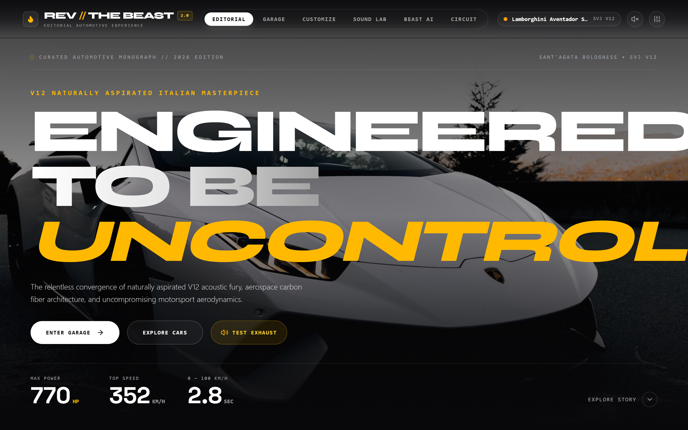
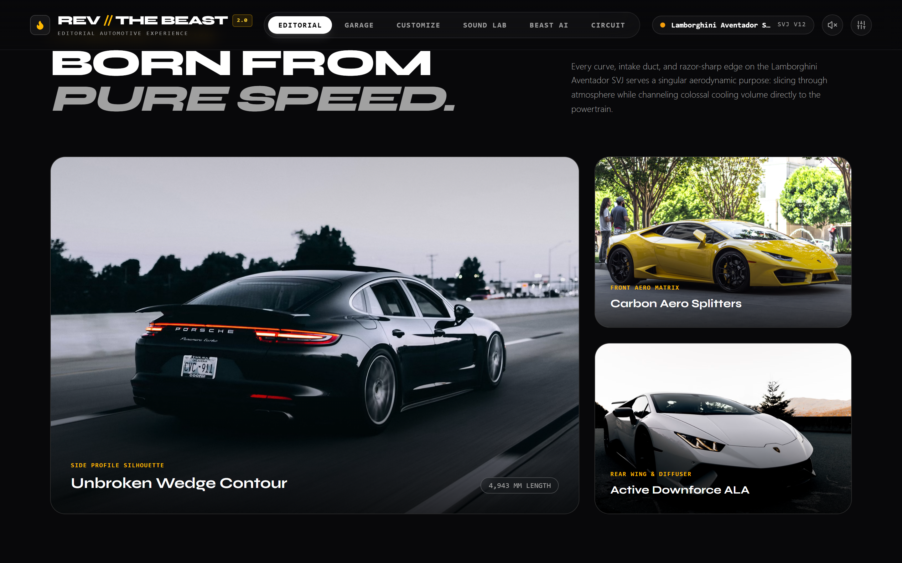
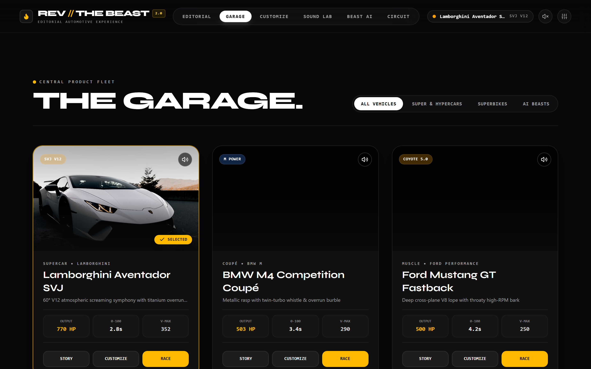
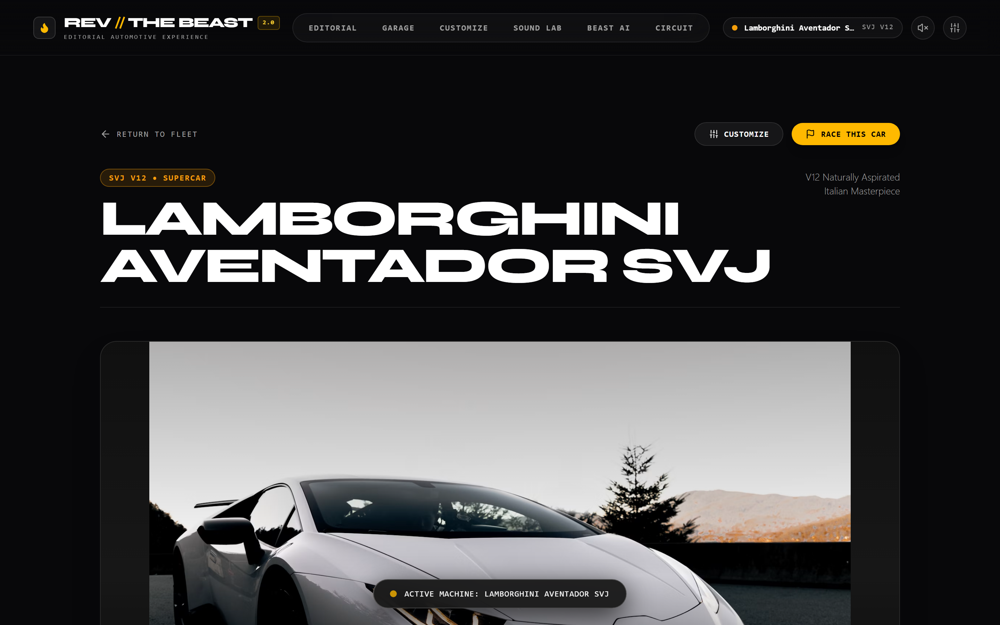
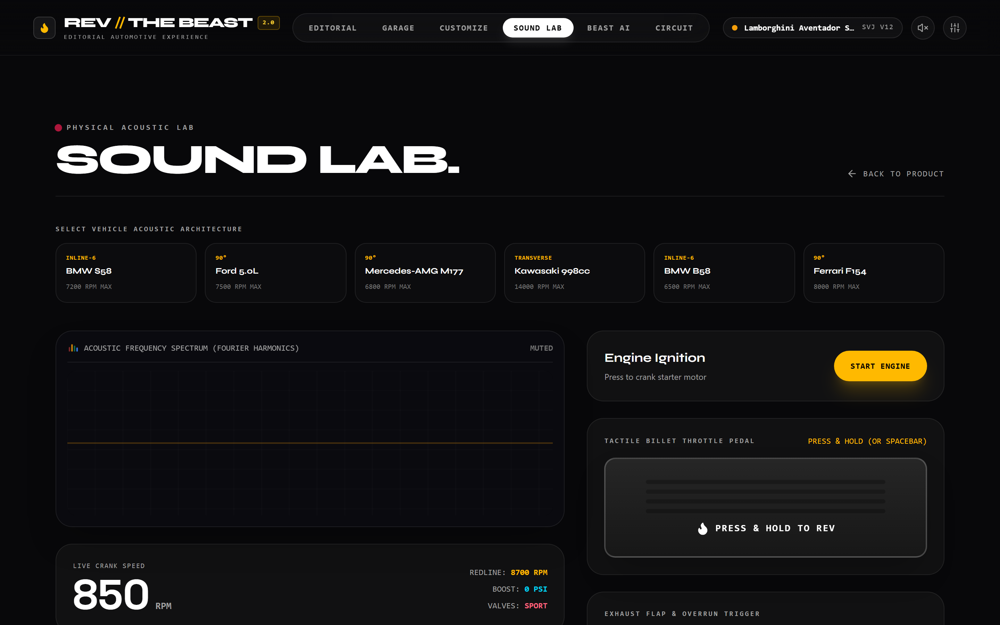
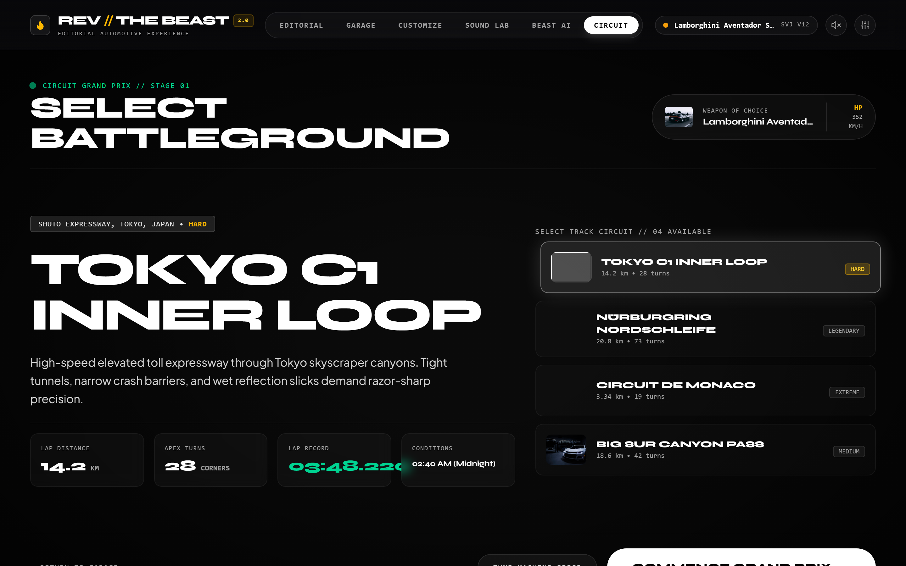

<div align="center">

# 🏎️ REV // THE BEAST
### *The High-Performance Automotive Editorial & Acoustic Synthesis Experience*

[](https://rev-the-beast.vercel.app/)
[](https://vercel.com/new/clone?repository-url=https%3A%2F%2Fgithub.com%2Fshubhamkerure07%2FREV-THE-BEAST-)
[](https://react.dev/)
[](https://www.typescriptlang.org/)
[](https://vitejs.dev/)
[](https://tailwindcss.com/)
[](https://developer.mozilla.org/en-US/docs/Web/API/Web_Audio_API)
[](#-mobile--phone-optimization)
[](LICENSE)

<br/>

> **"ENGINEERED TO BE UNCONTROLLED."**  
> An ultra-high-fidelity automotive platform merging **luxury editorial monograph storytelling**, **multi-angle 4K photography**, **real-time physical combustion audio synthesis**, and an **interactive motorsport Grand Prix racing simulator**.

<br/>

[🌐 Live Production Website](https://rev-the-beast.vercel.app/) • [🚀 Deploy on Vercel](https://vercel.com/new/clone?repository-url=https%3A%2F%2Fgithub.com%2Fshubhamkerure07%2FREV-THE-BEAST-) • [📖 Architecture](#-architecture--user-journey) • [🔊 Acoustic Engine](#-physical-modeling-acoustic-synthesis) • [🏁 Grand Prix Racing](#-grand-prix-circuit-racing-simulator) • [📱 Mobile Compatibility](#-mobile--phone-optimization)

---

</div>

<br/>

## 📸 Showcase & Visual Experience

| Feature Module | Actual Web Application Screenshot |
|:---|:---|
| **01. Editorial Hero & Monograph** | <br/>*High-contrast luxury monograph with bespoke typography (`Syne` + `Space Grotesk`), instant telemetry (770 HP, 352 KM/H, 2.8s), and full-bleed photography.* |
| **02. Story Scroll Monograph** | <br/>*Architectural sculpture, aerodynamic ALA matrix, and dynamic physical acoustic specifications.* |
| **03. Central Editorial Garage** | <br/>*Category filter tabs (Supercars, Superbikes, AI Beasts) with instant hover acoustic preview auditioning.* |
| **04. 9-Angle 4K Showcase** | <br/>*Zero 3D loading glitches: curated 9-angle studio photography covering Hero, Front, Side, Rear, Carbon Details, Cockpit Interior, Powertrain, Wheels, and Exhaust.* |
| **05. Signature Sound Lab** | <br/>*Real-time Web Audio Fourier oscilloscope & spectrum analyzer, heavy billet aluminum throttle pedal with smooth inertia ramp, 2-step launch limiter, and overrun gunshot backfire.* |
| **06. Circuit Racing Simulator** | <br/>*Interactive motorsport battlegrounds (Tokyo C1, Nürburgring Nordschleife, Monaco GP, Big Sur) with dynamic HUD, 20-segment LED shift lights, manual paddles, and live sound rev syncing.* |

---

## 🏛 Architecture & User Journey

REV // THE BEAST is designed around an uninterrupted luxury automotive journey:

```
[ EDITORIAL HERO ] ───► [ STORY SCROLL MONOGRAPH ] ───► [ GARAGE ]
                                                            │
    ┌───────────────────────────┬───────────────────────────┼───────────────────────────┐
    ▼                           ▼                           ▼                           ▼
[ CAR DETAIL ]          [ CUSTOMIZER ]              [ SOUND LAB ]               [ BEAST AI ]
9-Angle Photography     Photographic Paint Glaze    Real-Time Oscilloscope      Neural Spec Synthesis
Full Telemetry Specs    Acoustic Exhaust Tuning     2-Step Launch Limiter       One-Click Deploy
                                                            │
                                                            ▼
                                                [ CIRCUIT GRAND PRIX ]
                                                4 World-Class Circuits
                                                Interactive Racing HUD
                                                Lap Telemetry Debrief
```

---

## 🔊 Physical Modeling Acoustic Synthesis

Unlike typical automotive web apps playing static pre-recorded MP3 loops, REV // THE BEAST features a custom **pure procedural Web Audio synthesis engine** that calculates the acoustic physics of internal combustion and electric powertrains:

* **Asymmetric Firing Orders**:
  * **Lamborghini 6.5L L539 V12**: 60° V-angle firing, 12-cylinder harmonic choir screaming to an astronomical 8,700 RPM.
  * **Ford 5.0L Coyote Gen-4 V8**: 90° cross-plane crankshaft firing with visceral idle lope and thundering low-frequency muscle rumble.
  * **BMW 3.0L S58 TwinPower I6**: 120° even firing with metallic straight-six rasp, twin-turbo spool whistle, and rapid overrun crackles.
  * **Mercedes-AMG Handcrafted M177 V8**: Hot-V configuration with side-pipe bass detonations.
  * **Kawasaki Ninja H2R Supercharged I4**: Centrifugal supercharger impeller whine, blow-off flutter, and 14,000 RPM scream.
  * **Royal Enfield 648cc Parallel Twin**: 270° crossplane crank cadence with throaty cafe-racer megaphone burble.
  * **Porsche Taycan Dual Axial-Flux EV**: 10–14 kHz high-frequency IGBT inverter PWM carrier tone + planetary reduction gear whine (zero fake combustion sounds).
* **Multi-Layer Acoustic Crossfading**: Dynamically shifts between *Idle*, *Low-RPM*, *Mid-Cam*, and *Redline Harmonic Choir* layers.
* **Exhaust Metallurgy Tuning**: Modulates comb filter resonance between Stock Chrome, Burnt Titanium ($+25\%$ brightness), Matte Carbon, and Straight-Pipe Racing ($+45\%$ rasp).
* **2-Step Launch Control**: Simulates hard ignition cuts, fuel dumping into glowing manifolds, and gunshot exhaust pops.
* **Live FFT AnalyserNode**: Feeds the real-time HTML5 Canvas oscilloscope in the Sound Lab.

---

## 🏁 Grand Prix Circuit Racing Simulator

Experience real motorsport dynamics inside the browser:

* **4 Iconic Battlegrounds**:
  1. **Tokyo C1 Inner Loop** (14.2 km) — Elevated night tollway, wet asphalt, neon reflections.
  2. **Nürburgring Nordschleife** (20.8 km) — The Green Hell, 73 corners, 300m elevation swings.
  3. **Circuit de Monaco** (3.34 km) — Harbor chicane, tunnel acoustic scream, Sainte-Dévote braking.
  4. **Big Sur Canyon Pass** (18.6 km) — Pacific highway sunset sweepers, coastal mist.
* **Motorsport HUD Deck**:
  * Digital Speedometer (KM/H & MPH switchable).
  * Large Gear Indicator ($1$ through $7$ + Manual Mode).
  * 20-Segment LED Shift Lights Bar (Green $\to$ Amber $\to$ Flashing Redline indicator).
  * Deployable DRS Rear Aero Wing ($+15\%$ top speed).
  * Distance Progress Bar & Lap Timer with millisecond precision.
* **Audio-Physics Synchronization**: Acceleration pitches the physical engine sound, shifts trigger ignition-cut pops, and releasing throttle triggers compressor surge blow-off flutter (*STU-TU-TU-TU*).

---

## 📱 Mobile & Phone Optimization

The application has been engineered to deliver an uncompromising native-app feel on iPhones and Android smartphones:

* **Tactile Touch Pedals**: The throttle and ceramic brake pedals are equipped with `touch-none` and zero-delay touch listeners, preventing annoying mobile browser zoom, pull-to-refresh, or context-menu interruptions.
* **Viewport-Fit Cover**: Full support for edge-to-edge mobile screens, dynamic status bars (`apple-mobile-web-app-capable`), and Android navigation bars.
* **Mobile Editorial Drawer**: Fullscreen glassmorphic navigation overlay with direct access to Editorial, Garage, Customizer, Sound Lab, Beast AI, and Circuit.
* **Horizontal Swipeable Carousels**: 9-Angle camera angle pills, track cards, and color swatches support frictionless horizontal finger swiping.
* **Resilient Image Fallbacks**: Built-in `onError` fallback handlers guarantee no broken CDN images on mobile networks.

---

## 🛠️ Tech Stack & Architecture

* **UI Framework**: [React 18](https://react.dev/) + [TypeScript](https://www.typescriptlang.org/)
* **Build System**: [Vite 6](https://vitejs.dev/) (Production bundle in **2.5s**, Instant HMR)
* **Styling**: [Tailwind CSS 3.4](https://tailwindcss.com/) + Custom Glassmorphism Utilities
* **Acoustics**: Native Web Audio API (`AudioContext`, `BiquadFilterNode`, `WaveShaperNode`, `ConvolverNode`, `AnalyserNode`)
* **Visuals**: Curated 4K Automotive Photography + HTML5 Canvas FFT Oscilloscope
* **Typography**: Google Fonts (`Syne`, `Space Grotesk`, `Plus Jakarta Sans`)
* **Iconography**: [Lucide React](https://lucide.dev/)
* **Deployment**: [Vercel](https://vercel.com/) (Edge Network CDN with SPA Rewrites)

---

## 🚀 Getting Started

### Prerequisites
* [Node.js](https://nodejs.org/) (v18.0 or higher recommended)
* npm or pnpm or yarn

### Installation

1. **Clone the repository**:
   ```bash
   git clone https://github.com/shubhamkerure07/REV-THE-BEAST-.git
   cd REV-THE-BEAST-
   ```

2. **Install dependencies**:
   ```bash
   npm install
   ```

3. **Start local development server**:
   ```bash
   npm run dev
   ```
   Open **[http://localhost:3000](http://localhost:3000)** in your browser.

4. **Build for production**:
   ```bash
   npm run build
   ```
   The compiled assets will be ready in the `dist/` directory.

---

## 🌐 Deploy to Vercel (One-Click)

Deploy your own live instance of **REV // THE BEAST** in under 60 seconds:

[](https://vercel.com/new/clone?repository-url=https%3A%2F%2Fgithub.com%2Fshubhamkerure07%2FREV-THE-BEAST-)

### Deploy via Vercel CLI

```bash
# Install Vercel CLI globally
npm install -g vercel

# Deploy to preview
vercel

# Deploy to production
vercel --prod
```

The repository includes a ready-to-use [`vercel.json`](file:///c:/Users/Shubham/mite/c%20language/REV-THE-BEAST-/vercel.json) preconfigured for Vite single-page applications, custom asset caching, and route rewrites.

---

## 👨‍💻 Engineering & Author

**Shubham Kerure**  
*Mechatronics Engineering Student, Mangalore Institute of Technology & Engineering (MITE)*  
Passionate about automotive engineering, internal combustion acoustics, and high-performance interactive web systems.

* **GitHub**: [@shubhamkerure07](https://github.com/shubhamkerure07)
* **LinkedIn**: [Shubham Kerure](https://www.linkedin.com/in/shubham-kerure-23350938b)
* **Repository**: [https://github.com/shubhamkerure07/REV-THE-BEAST-](https://github.com/shubhamkerure07/REV-THE-BEAST-)

---

## 📄 License

This project is licensed under the [MIT License](LICENSE) — feel free to use, fork, and build upon it!